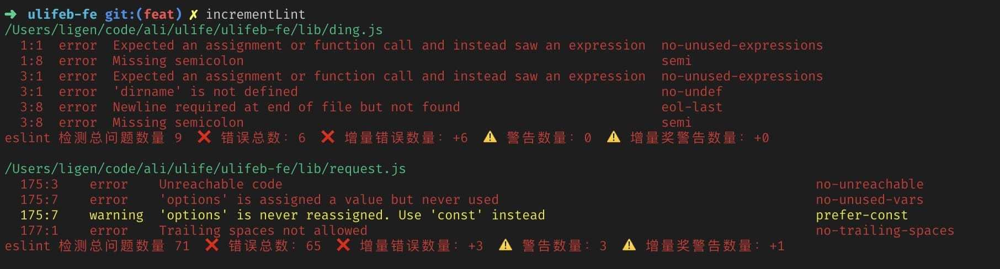

### IncrementLint

IncrementLint 是一个前端项目的eslint增量检测工具，适合为后期使用eslint进行代码校验的项目配置commit hooks，强制每次提交都针对这次修改的代码进行eslint校验

### Use
* 安装
tnpm i IncrementLint -g

* 使用
git add . 确保修改的文件已经暂存

* 调用检查命令
incrementLint

### dev
* 安装项目依赖
tnpm i

* link 命令
npm link

* 启动项目
npm run dev

### Effect
